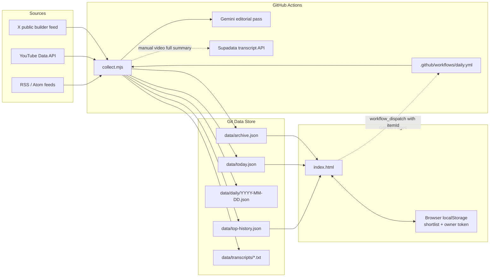
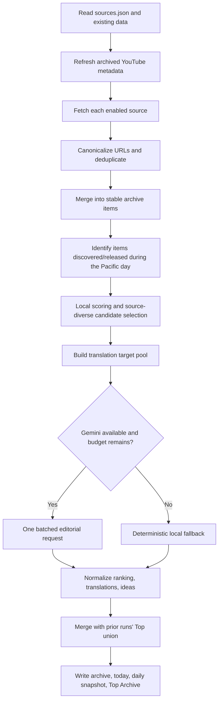
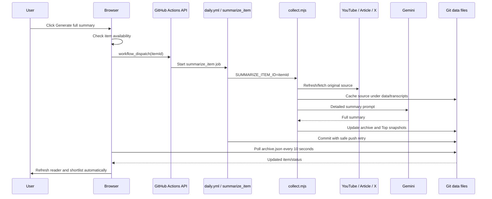

# AI Signal Desk — Agent Handoff and Architecture Guide

> **Audience:** coding agents and maintainers who need to continue the project without reconstructing its history from commits or chat logs.
>
> **Documented baseline:** the current architecture represented by `collect.mjs`, `index.html`, `sources.json`, the test suite, helper scripts, and the permanent `.github/workflows/daily.yml` workflow used in the latest project build.
>
> **Read this before changing code.** The project deliberately combines a static site, a Git-backed data store, scheduled collection, AI-assisted editorial ranking, manual full summaries, and a workflow-embedded installer. A change that looks local can affect several of those layers.

---

## 1. Executive summary

AI Signal Desk is a self-updating AI news and research dashboard designed to support high-quality Chinese content creation, especially for the RedNote account `@Kelly的科研日常`.

The system:

1. Collects public AI content from X, YouTube, RSS, and Atom feeds.
2. Normalizes and deduplicates items using stable IDs and canonical URLs.
3. Scores items locally at zero model cost.
4. Sends only a limited candidate set to Gemini in one editorial batch.
5. Produces Chinese summaries, editorial context, RedNote angles, and content ideas.
6. Accumulates every item selected into the current day's Top list rather than replacing earlier selections.
7. Stores a rolling 30-day archive and a day-by-day Top Archive in JSON committed to Git.
8. Lets the owner manually request a detailed full summary for a video, article, or sufficiently long X post.
9. Caches the original source text used for every full summary under `data/transcripts/`.
10. Serves everything as a static GitHub Pages site with no application server or database.

The primary design goal is **high editorial value at low or zero cost**, not maximum ingestion volume.

---

## 2. Product decisions that must be preserved

These are not incidental implementation details. They are current product requirements.

### 2.1 Editorial and content rules

- The UI chrome is English; translated summaries and content-analysis fields are Chinese.
- The dashboard is an editorial filter, not a raw firehose.
- Aggregators are useful for discovery, but original or official sources should be preferred for final content creation.
- Daily collection should not call Gemini once per article. It must batch candidates and translations into very few requests.
- `Today's Top` is cumulative for the current Pacific Time calendar day:
  - if an item is selected in any run that day, it stays in the day's list;
  - ranking is based on the item's highest score seen that day;
  - selection count breaks score ties before publication time.
- All Top cards use the same information structure, regardless of rank.
- Top cards remain compact; detailed reading happens in a modal reader.
- Content ideas must be deduplicated semantically. A single source should not produce several title variations of the same idea.

### 2.2 Date semantics

There are two different concepts of “today”:

- **Editorial day:** `America/Los_Angeles`, used by the collector for `today.json`, daily Top union, and Top Archive snapshots.
- **Viewer-local publication day:** used by the browser for `All New Today` and the grouped `All 30 Days` archive.

Do not casually merge those semantics. They answer different questions:

- “What was selected by the editorial system today in Pacific Time?”
- “What content was originally published today in the viewer's local timezone?”

### 2.3 Stable identity and state preservation

- YouTube IDs are stable as `yt:<video-id>` across upcoming, live, processing, and available states.
- X IDs are stable as `x:<post-id>`.
- Article IDs are hashes of canonical URLs: `article:<24-hex-prefix>`.
- A metadata or publication-time update must not create a new item.
- Browser shortlist state is keyed by stable item ID, so a scheduled video remains saved after release.
- Shortlist rendering must always prefer the latest archive object over an old localStorage snapshot.

### 2.4 Full summary rules

- Short summaries live in `summary`, `summaryZh`, and/or `editorial.summaryZh`.
- Detailed summaries live in `fullSummary`.
- Never store a detailed summary only in `summary`; a later digest run may replace the short summary.
- Original source text used for a detailed summary must be cached under `data/transcripts/`.
- A YouTube availability preflight must happen before Supadata is called.
- Upcoming, live, or replay-processing videos should return a visible `not_ready` status rather than failing the workflow.
- Every blog/article with a valid URL should offer “Generate full summary”; RSS excerpt length is not a reliable proxy for article length.

### 2.5 Infrastructure rules

- No server and no database.
- Runtime collector dependencies remain zero unless a deliberate architecture decision changes that.
- Scheduled jobs commit generated JSON back to `main`.
- All jobs that write `main` must share the same concurrency group and use safe push retry logic.
- Never use force push to resolve a data race.
- The site must remain usable if Gemini is unavailable; local ranking is the fallback.

---

## 3. System architecture



### Why this architecture exists

- **GitHub Actions** provides scheduled compute without maintaining a server.
- **GitHub Pages** serves a static dashboard cheaply and reliably.
- **JSON committed to Git** gives history, backups, and inspectability without a database.
- **Local scoring before Gemini** protects free-tier quota.
- **Manual full summaries** reserve transcript and model usage for content the owner actually wants to study.

### Main trade-offs

- Git is not a transactional database, so concurrent writers require explicit locking and retry logic.
- The static UI must poll committed JSON for asynchronous full-summary completion.
- `index.html` is a monolithic HTML/CSS/JS file, which is easy to deploy but harder to maintain.
- The custom feed parser and article extractor avoid dependencies but are heuristic.
- The owner token is browser-local, not a server-side session.

---

## 4. Repository layout

```text
ai-digest/
├── .github/
│   └── workflows/
│       └── daily.yml
├── data/
│   ├── archive.json
│   ├── today.json
│   ├── top-history.json
│   ├── daily/
│   │   └── YYYY-MM-DD.json
│   └── transcripts/
│       ├── <youtube-video-id>.txt
│       ├── article-<slug>-<hash>.txt
│       └── x-<post-id>-<hash>.txt
├── scripts/
│   ├── push-with-retry.sh
│   └── repair-full-summaries-from-history.mjs
├── tests/
│   ├── fixtures/
│   │   ├── atom.xml
│   │   └── rss.xml
│   ├── backfill-source-cache.test.mjs
│   ├── collector.test.mjs
│   ├── daily-top-union.test.mjs
│   ├── full-summary-fixes.test.mjs
│   ├── full-summary-history-recovery.test.mjs
│   ├── layout-language-regression.test.mjs
│   ├── top-reader.test.mjs
│   ├── ui-initialization.test.mjs
│   └── youtube-lifecycle.test.mjs
├── collect.mjs
├── index.html
├── sources.json
├── README.md
├── AGENTS.md
├── favicon.svg
└── apple-touch-icon.png
```

### File ownership

| File or directory | Role | Hand-edited? | Generated? |
|---|---|---:|---:|
| `collect.mjs` | Collector, ranking, editorial logic, full summaries, migrations | Yes | Installed by workflow payload in the current design |
| `index.html` | Entire static dashboard | Yes | Installed by workflow payload in the current design |
| `sources.json` | Source and editorial configuration | Yes | No |
| `.github/workflows/daily.yml` | Schedules, dispatch, installer, commits, Pages rebuild | Yes, carefully | No |
| `data/archive.json` | Rolling canonical item store | No | Yes |
| `data/today.json` | Current Pacific-day ranking and ideas | No | Yes |
| `data/daily/*.json` | Dated daily snapshots | No | Yes |
| `data/top-history.json` | Reader-ready Top Archive snapshots | No | Yes |
| `data/transcripts/*.txt` | Cached source text for detailed summaries | No | Yes |
| `scripts/push-with-retry.sh` | Safe Git rebase/push loop | Yes | Installed by workflow payload |
| `scripts/repair-full-summaries-from-history.mjs` | Recovers legacy detailed summaries | Yes | Installed by workflow payload |
| `tests/` | Regression suite | Yes | Installed by workflow payload |

---

## 5. The workflow is both orchestrator and installer

The current `daily.yml` has an unusual but important property: it contains a compressed, base64-encoded payload that installs the current `collect.mjs`, `index.html`, `tests/`, and `scripts/` when the workflow file itself is pushed.

### Trigger matrix

| Trigger | Job | Purpose |
|---|---|---|
| Push modifying `daily.yml` | `install` | Extract embedded payload, validate it, commit code, recover data, run first digest |
| Schedule 09:07 PT | `collect` | Full collection and editorial pass |
| Schedule 15:07 PT | `collect` | Full collection and editorial pass |
| Schedule 21:07 PT | `collect` | Full collection and editorial pass |
| Interleaved schedule at `:37` | `youtube_status` | Lightweight YouTube lifecycle refresh only |
| Manual dispatch with blank `itemId` | `collect` | Run a full digest immediately |
| Manual dispatch with `itemId` | `summarize_item` | Generate or regenerate one detailed summary |

### Full digest schedule

Pacific Time:

- 09:07
- 15:07
- 21:07

### Lightweight YouTube checks

Pacific Time:

- 01:37
- 03:37
- 05:37
- 07:37
- 11:37
- 13:37
- 17:37
- 19:37
- 23:37

The full digest already refreshes YouTube metadata, so the lightweight job skips the three full-run hours.

### Workflow permissions

```yaml
permissions:
  contents: write
  pages: write
```

### Concurrency contract

```yaml
concurrency:
  group: ai-digest-main-writer
  cancel-in-progress: false
  queue: max
```

Any future workflow that commits to `main` must use the same group. Otherwise jobs can race and produce `cannot lock ref` failures.

### Safe push design

All generated commits use `scripts/push-with-retry.sh`, which:

1. fetches the latest remote branch;
2. rebases the local commit;
3. tries to push;
4. retries up to eight times if the remote moved again;
5. aborts safely on a real merge conflict;
6. never force pushes.

### Important source-of-truth warning

Because `daily.yml` embeds the install payload, editing only root `collect.mjs`, `index.html`, `tests/`, or `scripts/` is not enough. A later change to `daily.yml` can reinstall the older embedded copies.

Current safe options:

1. **Keep the payload synchronized** whenever code changes; or
2. **Refactor the workflow** so root repository files become the only source of truth and remove the embedded installer.

The second option is cleaner long-term, but it is a deliberate migration, not a casual cleanup.

---

## 6. Configuration: `sources.json`

### Current top-level structure

```json
{
  "retentionDays": 30,
  "summaryLang": "zh",
  "editorial": {},
  "sources": []
}
```

### Editorial settings

| Field | Current/default role |
|---|---|
| `geminiModel` | Default Gemini model when `GEMINI_MODEL` is not supplied |
| `maxGeminiCalls` | Hard model-call budget per collector invocation |
| `candidateLimit` | Maximum locally ranked candidates sent to editorial ranking |
| `topPrimary` | Minimum desired candidate pool before recent fallback items are added |
| `topLimit` | Maximum items Gemini may select in one run; daily union may exceed this |
| `ideaLimit` | Maximum distinct content ideas displayed |
| `maxCandidatesPerSource` | Diversity cap before Gemini |
| `maxTopPerSource` | Diversity cap applied while normalizing Gemini's ranking |
| `initialBackfillDays` | First-run history window for a newly added source |
| `fallbackWindowHours` | Recent-item window used if the new-item pool is too small |
| `timeZone` | Editorial day boundary; currently `America/Los_Angeles` |
| `translationBackfillDays` | Optional; recent English-only items eligible for translation repair; default 7 |
| `translationLimit` | Optional; maximum translation targets per run; default 20 |

### Source fields

Common fields:

```json
{
  "type": "blog",
  "name": "OpenAI Engineering",
  "group": "OpenAI",
  "sourceType": "official",
  "priority": 1.0,
  "maxItems": 12,
  "enabled": true
}
```

| Field | Meaning |
|---|---|
| `type` | Adapter: `x-feed`, `youtube`, or `blog` |
| `name` | Specific feed/channel name |
| `group` | Sidebar grouping and diversity key |
| `sourceType` | `official`, `independent`, `curated`, or `community` |
| `priority` | 0–1 relevance weight for this editorial product; not universal credibility |
| `enabled` | Set `false` to disable without deleting config |
| `maxItems` | Feed/channel fetch limit |
| `url` | X feed JSON URL or RSS/Atom feed URL |
| `channelId` | Preferred YouTube channel identifier |
| `handle` | YouTube fallback channel lookup |
| `excerptChars` | Optional feed excerpt truncation override |
| `transcript` | Legacy/declarative setting; daily collection does not fetch transcripts automatically |

### Current source families

- Builders X feed
- AI Engineer YouTube
- OpenAI News
- OpenAI Engineering
- Google DeepMind
- Hugging Face Blog
- Latent Space AINews
- Simon Willison

---

## 7. Collector execution modes

`collect.mjs` selects behavior from environment variables.

### 7.1 Normal digest

```bash
node collect.mjs
```

Performs collection, merging, ranking, translation, daily union, and JSON writes.

### 7.2 Full summary for one item

```bash
SUMMARIZE_ITEM_ID='yt:VIDEO_ID' node collect.mjs
```

Legacy alias:

```bash
SUMMARIZE_VIDEO_ID='VIDEO_ID' node collect.mjs
```

The generic `SUMMARIZE_ITEM_ID` supports YouTube, blogs/articles, and eligible X posts.

### 7.3 Lightweight YouTube lifecycle refresh

```bash
REFRESH_YOUTUBE_STATUS=1 node collect.mjs
```

Updates upcoming/live/processing/available state without Gemini or Supadata transcript usage.

### 7.4 Backfill source caches

```bash
BACKFILL_FULL_SOURCES=1 node collect.mjs
```

Caches original text for items that already have detailed summaries.

By default, uncached YouTube transcripts are skipped during backfill to avoid transcript credits. To explicitly attempt those:

```bash
BACKFILL_FULL_SOURCES=1 BACKFILL_YOUTUBE_SOURCES=1 node collect.mjs
```

### 7.5 Migrate legacy full-summary fields

```bash
MIGRATE_FULL_SUMMARIES=1 node collect.mjs
```

Normal collection also performs legacy migration, but the dedicated mode is useful for maintenance.

---

## 8. Normal collection pipeline



### Step 1: read state

The collector loads:

- `sources.json`
- `data/archive.json`
- `data/today.json`
- `data/top-history.json`
- current dated snapshot if present

JSON writes use temporary files followed by atomic rename.

### Step 2: refresh existing YouTube items

Before new channel ingestion, archived YouTube items are refreshed in batches of up to 50 through `videos.list`. This lets scheduled videos transition without changing identity.

### Step 3: source adapters

#### X feed

`adaptXFeed()` reads the external builder feed JSON and preserves:

- post ID;
- author handle;
- author profile image when available;
- text;
- URL;
- timestamp;
- likes.

#### YouTube

`adaptYouTube()`:

1. resolves the uploads playlist;
2. fetches playlist items;
3. fetches video details and statistics in a batched call;
4. derives lifecycle state;
5. stores schedule, actual start/end, duration, views, and likes.

#### RSS / Atom

`adaptBlog()` calls `parseFeed()`, which supports:

- RSS `<item>` and Atom `<entry>`;
- namespaced tags;
- Atom alternate links;
- CDATA and common HTML entities;
- categories and authors;
- unknown publication dates.

A missing feed date remains `null`; it must not be replaced with fetch time.

### Step 4: canonicalization and deduplication

`canonicalizeURL()`:

- lowercases hostnames;
- removes fragments;
- removes common tracking parameters;
- normalizes YouTube watch URLs;
- sorts query parameters;
- removes trailing slashes.

Duplicates are merged by canonical URL. The higher-priority source wins display fields, while source tags, categories, engagement values, and dates are combined conservatively.

### Step 5: stable merge

`migrateAndMerge()` keeps prior fields that must survive re-collection:

- stable ID;
- `firstSeen`;
- detailed summary;
- editorial fields;
- source cache metadata;
- shortlist compatibility through unchanged IDs.

A scheduled video becoming live or available is added to `releasedIds`, so it can re-enter that day's editorial candidate pool without becoming a new archive item.

### Step 6: daily new-item pool

The collector maintains a cumulative `newIds` set for the Pacific editorial day. It includes:

- items first discovered during that day;
- items newly collected during the current run;
- previously scheduled YouTube items released during the day.

This “discovered today” pool is not the same as the UI's publication-date `All New Today` view.

### Step 7: local scoring

The local score is a 0–100 heuristic combining:

- configured source priority;
- source type bonus;
- publication freshness;
- topic keyword matches;
- visualizability signals;
- excerpt depth;
- engagement;
- negative penalties for recruiting, promotions, customer marketing, and sponsored material.

Tracked topic families include agents, workflow, coding, evaluation, science, research, reasoning, open source, multimodal, interpretability, safety, robotics, and model releases.

### Step 8: candidate diversity

`selectWithDiversity()` limits candidates per source group before Gemini. This prevents one prolific feed from dominating the entire editorial batch.

### Step 9: translation target pool

The collector requests Chinese translations for:

- new items;
- previously selected Top items lacking Chinese;
- current candidates;
- recent English-only archive items within the backfill window.

Already translated items drop out automatically.

### Step 10: Gemini editorial batch

`buildEditorialPrompt()` asks for:

- selected Top items;
- score;
- Chinese summary;
- why it matters;
- evidence;
- uncertainty;
- Chinese audience gap;
- RedNote angle;
- topics;
- up to three distinct content ideas;
- translations for all translation targets.

The collector normally uses one request. A second call may be used to repair invalid JSON or missing Chinese translations. `GEMINI_MAX_CALLS` is a hard cap.

### Step 11: fallback behavior

If Gemini is missing, over quota, or returns unusable output:

- local scores determine the ranking;
- heuristic Chinese-facing editorial fields are used where possible;
- the run still writes data and the website remains functional;
- `run.usedGemini` is false and errors are recorded.

### Step 12: cumulative daily Top

`mergeDailyRanking()` combines the new ranking with every prior selection from the same Pacific day.

Per item it records:

- `firstSelectedAt`
- `lastSelectedAt`
- `selectionCount`
- `lastScore`
- `peakScore`

Sort order:

1. `peakScore` descending;
2. `selectionCount` descending;
3. item publication time descending;
4. first-selection timestamp.

No item selected earlier that day is silently dropped.

### Step 13: content idea deduplication

`dedupeIdeas()` compares:

- normalized title/angle/why-now tokens;
- source overlap;
- Chinese bigram overlap;
- single-source duplication.

Newer ideas are considered first. A distinct older idea may remain if the current run does not cover the same story.

---

## 9. Data model

### 9.1 `data/archive.json`

The canonical rolling store:

```json
{
  "generatedAt": "2026-07-22T04:07:00.000Z",
  "count": 141,
  "items": []
}
```

### Base item fields

```json
{
  "id": "yt:Cz4v1WHVyZc",
  "kind": "youtube",
  "source": "AI Engineer",
  "sourceGroup": "AI Engineer",
  "sourceType": "curated",
  "sourcePriority": 0.75,
  "sourceTags": ["AI Engineer"],
  "author": "AI Engineer",
  "subtitle": "YouTube",
  "title": "HTML Is All Agents Need",
  "text": "",
  "excerpt": "Source description...",
  "summary": "Chinese short summary...",
  "summaryZh": "Chinese short summary...",
  "summaryLanguage": "zh",
  "url": "https://www.youtube.com/watch?v=Cz4v1WHVyZc",
  "canonicalUrl": "https://www.youtube.com/watch?v=Cz4v1WHVyZc",
  "ts": 1784726400000,
  "firstSeen": 1784720000000,
  "likes": 30,
  "views": 1377,
  "full": false
}
```

### Editorial fields

```json
{
  "signals": {
    "localScore": 74,
    "reasons": ["curated source +8", "fresh +15", "topic fit +24"],
    "topics": ["agents", "workflow", "coding"]
  },
  "editorial": {
    "summaryZh": "...",
    "whyItMattersZh": "...",
    "evidenceZh": "...",
    "uncertaintyZh": "...",
    "chineseAudienceGapZh": "...",
    "rednoteAngleZh": "...",
    "topics": ["agents", "workflow"],
    "processedAt": "...",
    "model": "gemini-3.1-flash-lite"
  }
}
```

### Detailed-summary fields

```json
{
  "full": true,
  "fullSummary": "Detailed Chinese summary...",
  "fullSummaryAt": "2026-07-22T05:12:00.000Z",
  "fullSummaryAttemptAt": "2026-07-22T05:12:00.000Z",
  "fullSummaryStatus": "ready",
  "fullSummarySource": "transcript",
  "fullSummaryChars": 4200,
  "fullSummaryBillableRequests": 1,
  "fullSummaryTranscriptStatus": 200,
  "fullSourcePath": "data/transcripts/Cz4v1WHVyZc.txt",
  "sourceTextPath": "data/transcripts/Cz4v1WHVyZc.txt",
  "transcriptPath": "data/transcripts/Cz4v1WHVyZc.txt",
  "fullSourceChars": 18500,
  "fullSourceCachedAt": "..."
}
```

Possible status values include:

- `ready`
- `not_ready`
- `error`
- `needs_regeneration`
- empty/unset before the first request

### YouTube lifecycle fields

```json
{
  "videoId": "khVX_BUnEwU",
  "youtubeState": "upcoming",
  "liveBroadcastContent": "upcoming",
  "scheduledStartTime": "2026-07-22T18:00:00.000Z",
  "actualStartTime": "",
  "actualEndTime": "",
  "youtubePublishedAt": "...",
  "playlistVideoPublishedAt": "...",
  "playlistAddedAt": "...",
  "publishedAt": "",
  "youtubeUploadStatus": "uploaded",
  "availabilityUpdatedAt": "..."
}
```

Lifecycle:

```text
upcoming -> live -> processing -> available
```

### 9.2 `data/today.json`

Current Pacific editorial day:

```json
{
  "generatedAt": "...",
  "date": "2026-07-22",
  "timeZone": "America/Los_Angeles",
  "newCount": 12,
  "newIds": [],
  "topIds": [],
  "scanIds": [],
  "ranking": [],
  "ideas": [],
  "run": {}
}
```

`scanIds` remains for backward compatibility but the current UI treats every selected item as part of one Top ranking.

### Ranking entry

```json
{
  "id": "article:...",
  "rank": 1,
  "score": 92,
  "peakScore": 92,
  "lastScore": 89,
  "selectionCount": 3,
  "firstSelectedAt": "...",
  "lastSelectedAt": "...",
  "tier": "top",
  "reason": "Strong workflow signal"
}
```

### Run telemetry

Common `run` fields:

- source attempts/successes/failures;
- fetched and deduplicated item counts;
- new and released item counts;
- candidate and translation target counts;
- Gemini call count and model;
- whether Gemini was used;
- accumulated Top size;
- lifecycle update count;
- error strings;
- start and finish timestamps.

### 9.3 `data/daily/YYYY-MM-DD.json`

A dated copy of the day's cumulative `today.json`. It is used for recovery and history construction.

### 9.4 `data/top-history.json`

```json
{
  "generatedAt": "...",
  "days": [
    {
      "date": "2026-07-22",
      "generatedAt": "...",
      "ranking": [],
      "ideas": [],
      "items": []
    }
  ]
}
```

Each `items` array contains reader-ready snapshots, including full summary and lifecycle fields. The UI groups these days in expandable outlines.

### 9.5 `data/transcripts/`

Despite the directory name, it stores source text for every full-summary type:

- YouTube transcript;
- extracted article body or feed fallback;
- original X post text.

This cache provides reproducibility and prevents unnecessary repeated extraction or transcript charges.

---

## 10. Full-summary workflow



### UI owner mode

- The site stores a fine-grained GitHub token in browser localStorage.
- Saving the token first validates access against the `daily.yml` workflow endpoint.
- Recommended token scope:
  - only the `ai-digest` repository;
  - Actions: Read and write.
- The token must never be committed or shared.

### Polling behavior

After dispatch, the UI polls `data/archive.json` every 10 seconds for up to 30 attempts, roughly five minutes.

It stops when:

- a new `fullSummaryAt` appears; or
- the collector records a new `not_ready` or `error` attempt.

### Source acquisition

#### YouTube

1. Refresh official video metadata.
2. Block known upcoming/live/processing states before transcript service use.
3. Reuse cached transcript if present.
4. Request Supadata native transcript only when needed.
5. Record HTTP status and reported billable request count.

#### Blog/article

1. Fetch HTML.
2. Prefer JSON-LD `articleBody`.
3. Otherwise examine `article`, `main`, and content-like containers.
4. Fall back to feed excerpt if extraction fails.
5. Cache the exact text sent to Gemini.

#### X

Use the archived original post text and cache it.

### Not-ready behavior

A not-ready YouTube summary request writes state rather than failing the job:

```json
{
  "fullSummaryStatus": "not_ready",
  "fullSummaryErrorCode": "youtube_upcoming",
  "fullSummaryMessage": "...",
  "fullSummaryRetryAt": "..."
}
```

The website then shows an availability message and disables an impossible request until appropriate.

---

## 11. Front-end architecture

The dashboard is a single static `index.html` with embedded CSS and JavaScript.

### Application state

```js
{
  items: [],
  today: { topIds: [], scanIds: [], ranking: [], ideas: [], run: {} },
  history: { days: [] },
  filter: "top",
  topView: "today",
  saved: {}
}
```

### Data loading

`load()` fetches with cache-busting query parameters:

- `data/archive.json` — required;
- `data/today.json` — optional fallback;
- `data/top-history.json` — optional fallback.

If the archive is missing or invalid, the page displays an explicit error instead of silently showing an empty site.

### Main filters

- `Today's Top`
- `All New Today`
- `My Shortlist`
- `Full Summaries`
- `All 30 Days`

Source-group filters appear separately below the main filters.

### Top views

The `Today / Top Archive` toggle appears only inside `Today's Top`.

- **Today:** cumulative ranking for the current editorial day.
- **Top Archive:** expandable date groups with historical ranking snapshots.

### All New Today

Uses the item's original publication timestamp, interpreted in the viewer's browser timezone. Upcoming YouTube items are excluded until release.

### All 30 Days

Grouped by original publication date with expandable `<details>` outlines. Special groups:

- `Upcoming`
- `Unknown publication date`

### Top cards

Every Top item uses the same card layout:

- rank;
- source metadata;
- score;
- title;
- short Chinese summary or source description;
- Why it matters;
- RedNote angle;
- Evidence & uncertainty;
- save and open controls.

Cards use `min-height`, not fixed height, and grow safely when content wraps.

### Reader modal

Clicking a Top card opens a modal reader without expanding the grid card.

The reader shows:

- metadata and rank context;
- YouTube cover image with high-resolution fallback;
- short summary;
- detailed summary when available;
- original X post where relevant;
- why it matters;
- RedNote angle;
- evidence;
- uncertainty;
- Chinese audience gap;
- full-summary controls;
- save/open controls.

On mobile it becomes a near-full-screen bottom sheet.

### Rich text and Show more / Show less

The UI safely escapes content, then supports limited Markdown-like rendering:

- `**bold**`;
- short standalone headings;
- inline code;
- bullets and paragraph breaks.

Long text uses clamped previews with `Show more / Show less`. Detailed summaries force the toggle to be available even when initial hidden layout measurement is unreliable.

### X avatars

The UI prefers stored avatar fields from the feed. If missing, it uses an `unavatar.io/x/<handle>` fallback, then a letter avatar if image loading fails.

### Shortlist

- Saved in browser localStorage under `ai-signal-shortlist`.
- Keyed by stable item ID.
- Snapshots are synchronized with current archive objects after loading and polling.
- Not synchronized across browsers or devices.
- Export creates a JSON backup.
- “Compose post” copies a Chinese prompt for generating RedNote ideas from selected items.

---

## 12. API and cost behavior

### Gemini

Used for:

- editorial ranking;
- Chinese translation;
- RedNote angles and content ideas;
- manual detailed summaries.

Cost controls:

- local pre-scoring;
- candidate limit;
- translation limit;
- one batched editorial request;
- maximum two calls per run by default;
- deterministic fallback if unavailable.

### YouTube Data API

Used for:

- uploads playlist discovery;
- video metadata;
- statistics;
- schedule/live/replay state;
- actual release timing.

The lightweight lifecycle job does not use Gemini or Supadata.

### Supadata

Used only for uncached manual YouTube full summaries.

The collector:

- requests native transcripts;
- checks YouTube availability first;
- reuses cached transcript files;
- logs `x-billable-requests` when provided;
- records billable count and HTTP status in archive metadata.

### X feed and RSS/Atom

Fetched from public endpoints without paid API calls in the current setup.

### GitHub

- Actions executes the collector.
- Pages hosts the site.
- Git stores generated state.
- The workflow explicitly requests a Pages rebuild after bot commits.

---

## 13. Test suite

Run all tests before committing architecture or behavior changes.

```bash
node --check collect.mjs
for test in tests/*.test.mjs; do
  node "$test"
done
```

The workflow additionally extracts the inline browser script and runs `node --check` on it.

### Test responsibilities

| Test | Protects |
|---|---|
| `collector.test.mjs` | URL normalization, HTML stripping, RSS/Atom parsing, unknown dates, dedup, local scoring, article extraction |
| `daily-top-union.test.mjs` | Cumulative Top union, score ordering, selection counts, Pacific day boundary, idea dedup |
| `youtube-lifecycle.test.mjs` | Upcoming/live/processing/available states, stable IDs, publication-date correction, no-quota preflight behavior |
| `full-summary-fixes.test.mjs` | Dedicated fullSummary field, source-cache paths, Full Summaries filter, shortlist live sync, safe rich text |
| `backfill-source-cache.test.mjs` | Existing transcript reuse and X source-cache creation |
| `full-summary-history-recovery.test.mjs` | Recovery of previously overwritten detailed summaries from Git history |
| `top-reader.test.mjs` | Uniform Top card contract, reader modal, Top Archive, full-summary controls |
| `layout-language-regression.test.mjs` | Responsive card layout, video reader cover, Chinese-summary labeling/repair |
| `ui-initialization.test.mjs` | `load()` exists, is called, and the browser script parses |

### Testing philosophy

Many past regressions came from integration seams rather than isolated functions. New tests should protect observable contracts, for example:

- “a Top action row never depends on fixed card height”;
- “an English source description is never mislabeled Chinese summary”;
- “a full summary survives the next normal digest merge”;
- “a scheduled YouTube release preserves shortlist identity.”

---

## 14. Safe development workflow for a new agent

### Step 1: establish the actual source of truth

Before editing, inspect:

```text
collect.mjs
index.html
sources.json
.github/workflows/daily.yml
data/*.json
```

Check whether the current root files match the workflow's embedded payload. Do not assume they do.

### Step 2: perform a blindspot pass

Before coding, answer:

- Does this change affect item IDs?
- Does it alter original publication-date semantics?
- Does it alter Pacific editorial-day semantics?
- Does it affect both live archive items and Top Archive snapshots?
- Does it affect shortlist snapshots?
- Does it require a schema migration?
- Could it spend Gemini or Supadata quota?
- Could two jobs write the same file concurrently?
- Does it need a UI regression test at desktop and mobile widths?

Ask the maintainer one high-leverage question at a time when behavior is ambiguous.

### Step 3: change the smallest coherent set

A schema field used in the UI usually requires changes to:

1. collection or migration logic;
2. archive merge logic;
3. Top history snapshots;
4. front-end rendering;
5. tests;
6. possibly workflow environment or dispatch inputs.

Do not patch only the visible symptom.

### Step 4: preserve short/full summary separation

When touching summary code, verify:

```text
summary          = concise list preview
summaryZh        = concise Chinese preview
fullSummary      = detailed generated summary
editorial.*      = contextual analysis
```

### Step 5: validate locally

At minimum:

```bash
node --check collect.mjs
node tests/collector.test.mjs
node tests/daily-top-union.test.mjs
node tests/youtube-lifecycle.test.mjs
node tests/full-summary-fixes.test.mjs
node tests/top-reader.test.mjs
node tests/layout-language-regression.test.mjs
node tests/ui-initialization.test.mjs
```

For front-end work, render at approximately:

- 1326px desktop;
- 900px tablet;
- 390px mobile.

Check:

- horizontal overflow;
- text crossing card borders;
- modal scrolling;
- actions inside cards;
- English/Chinese labels;
- video thumbnails;
- show-more controls.

### Step 6: synchronize the embedded workflow payload

Current deployment can reinstall the embedded copies. If the installer remains in use, package the updated files and replace the base64 payload in `daily.yml`.

Conceptual build process:

```bash
mkdir -p payload
cp collect.mjs index.html payload/
cp -R tests scripts payload/
tar -czf /tmp/ai-digest-payload.tar.gz -C payload .
base64 /tmp/ai-digest-payload.tar.gz > /tmp/payload.b64
```

Then replace the content between the workflow's `PAYLOAD` heredoc markers. Re-extract it and byte-compare against source files before release.

A better long-term refactor is to remove the embedded installer and let checked-in root files be authoritative.

### Step 7: commit generated data carefully

- Never hand-edit data merely to make a screenshot pass unless performing a documented migration.
- Use atomic writes in Node.
- Use the shared writer lock.
- Use `push-with-retry.sh`.
- Never force push.

### Step 8: update this guide

Any architecture-level change should update `AGENTS.md` and relevant README instructions in the same change.

---

## 15. Common extension recipes

### Add a blog source

Edit `sources.json`:

```json
{
  "type": "blog",
  "name": "Example Research Blog",
  "group": "Example",
  "sourceType": "official",
  "priority": 0.9,
  "url": "https://example.com/feed.xml",
  "maxItems": 12,
  "enabled": true
}
```

Then test the feed with `parseFeed()` fixtures if it uses unfamiliar XML patterns.

### Add a YouTube channel

```json
{
  "type": "youtube",
  "name": "Example Channel",
  "group": "Example Channel",
  "sourceType": "curated",
  "priority": 0.8,
  "channelId": "UC...",
  "maxItems": 15,
  "enabled": true
}
```

Prefer `channelId` over handle lookup.

### Add a new editorial topic

Add a rule to `TOPIC_RULES` with:

- topic name;
- weight;
- regex.

Then update:

- `rednoteAngleFor()` if the topic needs a tailored angle;
- fallback idea templates;
- scoring tests.

### Add a new item kind

You must define:

- stable ID generation;
- source adapter;
- canonical URL behavior;
- merge behavior;
- source cache path;
- full-summary source extraction;
- generic UI rendering;
- reader rendering;
- filter/date behavior;
- tests.

### Add a new filter

Update:

- `navDefinitions()`;
- `updateHeader()` labels;
- `filteredItems()`;
- `renderList()` if it has special grouping;
- CSS if needed;
- UI regression tests.

### Change schedule

Edit both:

- `on.schedule` entries;
- job `if` expressions that match `github.event.schedule` strings.

If only one side changes, scheduled runs may start but no job will execute.

---

## 16. Known limitations and technical debt

### 16.1 Monolithic front-end

`index.html` contains all HTML, CSS, and JavaScript. It is deployment-simple but makes review and testing harder. A future refactor could split it into static modules while preserving zero-build deployment.

### 16.2 Embedded payload duplication

The same code exists in root files and compressed inside `daily.yml`. This is the largest maintenance hazard. Consider replacing the install job with normal checked-in code and a standard CI validation job.

### 16.3 Custom XML parsing

The zero-dependency parser handles common feeds but is not a full XML implementation. New feeds may expose unsupported namespace or link patterns.

### 16.4 Heuristic article extraction

JavaScript-heavy pages, login walls, and aggressive anti-bot protection may yield only the feed excerpt. The UI should report extraction failure rather than hiding the full-summary option.

### 16.5 Browser-only shortlist

The shortlist is not shared across devices. Export is the current backup mechanism.

### 16.6 Browser-local owner token

Convenient, but sensitive. It should be fine-grained, repo-scoped, and revoked when no longer needed. A future GitHub App or OAuth flow would be safer.

### 16.7 Git as a data store

Top snapshots and source caches grow repository history. Thirty-day live retention limits current files but not Git history. Long-term archival policy may eventually be needed.

### 16.8 Relative Gemini scores

Scores are editorial judgments from independent batches. Using `peakScore` stabilizes a day's union, but a score from a morning batch is not mathematically calibrated against every later batch.

---

## 17. Troubleshooting guide

### Website is empty or stuck loading

Check:

1. browser console for `load is not defined` or parse errors;
2. `data/archive.json` exists and is valid JSON;
3. inline application script passes `node --check`;
4. Pages has rebuilt after the latest commit.

`ui-initialization.test.mjs` exists specifically to prevent missing `load()` regressions.

### Top card controls escape the card border

- Search for fixed `height` on `.top-card`.
- Keep `min-height` plus `height:auto`.
- Test mobile and tablet widths.

### Top ranking appears out of score order

- UI sorts by `peakScore`, then selection count.
- Collector must call `mergeDailyRanking()`.
- Do not trust an old `rank` field over the numeric score.

### An earlier Top disappears later the same day

- Inspect `data/daily/<date>.json` and `today.json`.
- Confirm the previous day's current snapshot is loaded before merge.
- Confirm `mergeDailyRanking(previous, current, ...)` is used.

### Full summary badge exists but text is missing

- Inspect `fullSummary`, not only `full`.
- Run `scripts/repair-full-summaries-from-history.mjs`.
- If unrecoverable, status should become `needs_regeneration`.

### Full summary appears in one tab but not Shortlist

- Confirm `syncSavedWithLive()` runs after load and polling.
- Shortlist rendering must use `itemById()`, not stale localStorage snapshots directly.

### GitHub owner mode returns 401

The browser token is invalid, expired, or revoked. Save a new fine-grained token. Do not put it in repository secrets unless a separate workflow explicitly needs it.

### Owner mode returns 403 or 404

The token lacks repository access or Actions: Read and write.

### YouTube summary reports not available

Inspect:

- `youtubeState`;
- `scheduledStartTime`;
- `fullSummaryErrorCode`;
- `fullSummaryBillableRequests`;
- `fullSummaryTranscriptStatus`.

Known upcoming/live/processing states should be stopped before transcript service usage.

### Long article lacks usable source text

- Test `readableArticleText()` against the actual HTML.
- Check JSON-LD.
- Check whether content is client-rendered.
- Preserve feed fallback and surface an honest error.

### Push fails with `cannot lock ref`

- Ensure all writing workflows use `ai-digest-main-writer`.
- Ensure checkout uses `ref: main` and `fetch-depth: 0`.
- Ensure commits use `push-with-retry.sh`.
- Remove obsolete workflows that still write `main` under another concurrency group.

### Push is rejected for modifying workflow files

GitHub's built-in workflow token cannot arbitrarily rewrite workflow files in some contexts. Do not design one-time installers that try to delete or modify `.github/workflows/*.yml` from their own bot commit.

---

## 18. Handoff checklist

Before handing the project to another agent or maintainer, record:

- current commit SHA;
- whether root code matches embedded workflow payload;
- last successful full digest run;
- last successful lightweight YouTube run;
- current enabled sources;
- active model override, if any;
- outstanding failed full summaries;
- unrecoverable source-extraction cases;
- obsolete workflows that should be removed;
- tests added for the latest bug fix;
- any data schema migration performed.

A good handoff should include the output of:

```bash
git status --short
git log -5 --oneline
find .github/workflows -maxdepth 1 -type f -print
node --check collect.mjs
for test in tests/*.test.mjs; do node "$test"; done
```

---

## 19. Recommended next architectural improvement

The highest-value cleanup is to remove the self-installing base64 payload from `daily.yml`.

Recommended target:

```text
root source files = single source of truth
workflow = checkout -> test -> run -> commit data -> rebuild Pages
```

That refactor would:

- eliminate duplicate code copies;
- make pull-request diffs readable;
- reduce workflow size;
- prevent old payloads from overwriting new root files;
- simplify agent maintenance.

It should be performed as a dedicated migration with full regression tests, not mixed into an unrelated UI or ranking change.
