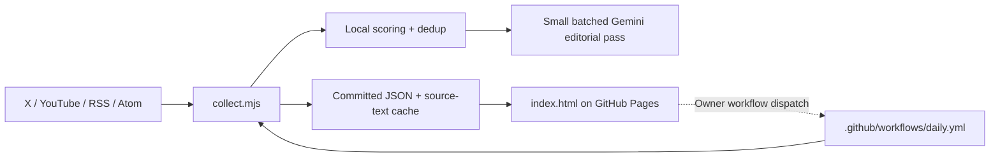

# AI Signal Desk

A self-updating AI editorial dashboard for discovering high-value English AI content, translating and contextualizing it for Chinese readers, and developing strong RedNote content ideas.

The project runs entirely on GitHub Actions and GitHub Pages. It has no application server and no database.

> For architecture, data schemas, workflow internals, design rationale, troubleshooting, and coding-agent instructions, read **[AGENTS.md](./AGENTS.md)**.

## What it does

- Collects AI signals from:
  - an X builder feed;
  - YouTube channels;
  - RSS and Atom feeds.
- Tracks official, independent, curated, and community sources separately.
- Canonicalizes URLs and merges duplicate articles across feeds.
- Uses free local heuristics to pre-rank content before spending model quota.
- Sends a small, source-diverse candidate batch to Gemini for:
  - Chinese summaries;
  - editorial ranking;
  - “Why it matters” context;
  - evidence and uncertainty;
  - RedNote angles;
  - up to three deduplicated content ideas.
- Keeps every item selected during the same Pacific Time day in `Today's Top`.
- Maintains a rolling 30-day archive and an expandable day-by-day Top Archive.
- Supports manual detailed summaries for videos, articles, and long X posts.
- Caches the original source text used for every detailed summary.
- Tracks scheduled, live, replay-processing, and released YouTube videos.
- Provides a responsive reader modal so long summaries do not stretch grid cards.
- Stores the owner's shortlist in browser localStorage and exports it as JSON.

## Architecture



### Why this design

- **Low cost:** public feeds, small YouTube API usage, batched Gemini calls, on-demand transcripts.
- **No infrastructure:** GitHub Actions performs scheduled work and GitHub Pages hosts the site.
- **Auditable:** generated data and historical snapshots are ordinary files in Git.
- **Resilient:** local ranking keeps the site updating even when Gemini is unavailable.

## Repository structure

```text
.github/workflows/daily.yml        Permanent scheduler and manual-summary workflow
collect.mjs                        Collection, ranking, translation, lifecycle, and full summaries
index.html                         Entire static dashboard
sources.json                       Source and editorial configuration

data/archive.json                 Canonical rolling 30-day item archive
data/today.json                   Current Pacific-day Top union and ideas
data/daily/YYYY-MM-DD.json         Daily snapshots
data/top-history.json             Reader-ready Top Archive
data/transcripts/*.txt            Cached transcript/article/post source text

scripts/push-with-retry.sh         Race-safe Git push helper
scripts/repair-full-summaries-from-history.mjs
                                    Legacy full-summary recovery
tests/                             Node regression suite
AGENTS.md                          Detailed maintainer and coding-agent guide
```

## Current dashboard views

Main navigation:

- **Today's Top**
- **All New Today**
- **My Shortlist**
- **Full Summaries**
- **All 30 Days**

`Today's Top` contains two subviews:

- **Today** — cumulative Top list for the current Pacific editorial day.
- **Top Archive** — previous daily Top lists grouped in expandable sections.

The rest of the interface is English. Translated summaries and editorial content are Chinese.

## Setup

### 1. Create or fork the repository

The repository must be public if you want standard public GitHub Pages behavior without additional hosting configuration.

### 2. Add repository secrets

Go to:

```text
Settings -> Secrets and variables -> Actions -> New repository secret
```

Required for the normal feature set:

| Secret | Purpose |
|---|---|
| `GEMINI_API_KEY` | Editorial ranking, Chinese translation, content ideas, full summaries |
| `YOUTUBE_API_KEY` | YouTube uploads, metadata, statistics, and lifecycle state |

Optional:

| Secret | Purpose |
|---|---|
| `SUPADATA_API_KEY` | Native YouTube transcript retrieval for manual full summaries |
| `GEMINI_MODEL` | Override the model configured in `sources.json` |

If `SUPADATA_API_KEY` is absent, normal YouTube collection still works; only uncached detailed video summaries are unavailable.

### 3. Allow workflow writes

Go to:

```text
Settings -> Actions -> General -> Workflow permissions
```

Select:

```text
Read and write permissions
```

### 4. Enable GitHub Pages

Go to:

```text
Settings -> Pages
```

Use:

```text
Deploy from a branch
Branch: main
Folder: / (root)
```

### 5. Run the first digest

Open:

```text
Actions -> Daily digest -> Run workflow
```

Leave `itemId` blank for a normal full digest.

## Schedule

The workflow uses `America/Los_Angeles`.

### Full digest

- 09:07 PT
- 15:07 PT
- 21:07 PT

Each full run:

1. refreshes YouTube availability;
2. fetches every enabled source;
3. deduplicates and merges items;
4. locally scores candidates;
5. requests batched editorial output from Gemini when available;
6. merges newly selected items into the day's cumulative Top;
7. writes archive and history data;
8. commits changes and rebuilds Pages.

### Lightweight YouTube lifecycle checks

The workflow also runs metadata-only checks between full digests. These do not call Gemini or Supadata.

## Add or edit sources

Edit `sources.json`.

### RSS or Atom feed

```json
{
  "type": "blog",
  "name": "Example AI Lab",
  "group": "Example AI Lab",
  "sourceType": "official",
  "priority": 0.9,
  "url": "https://example.com/feed.xml",
  "maxItems": 12,
  "enabled": true
}
```

### YouTube channel

```json
{
  "type": "youtube",
  "name": "Example Channel",
  "group": "Example Channel",
  "sourceType": "curated",
  "priority": 0.8,
  "channelId": "UCxxxxxxxxxxxxxxxxxxxxxx",
  "maxItems": 15,
  "enabled": true
}
```

Prefer a `channelId` over a handle lookup.

### Source types

- `official`
- `independent`
- `curated`
- `community`

`priority` is a relevance weight for this dashboard's editorial goals, not a universal credibility score.

## Manual full summaries

The dashboard's **Owner mode** can dispatch the existing `daily.yml` workflow for one archive item.

### Token requirements

Create a fine-grained GitHub token with:

- access only to this repository;
- **Actions: Read and write**.

The token is stored only in the current browser's localStorage. Do not commit or share it.

### Supported items

- YouTube videos with available native transcripts;
- blog and article URLs;
- sufficiently long X posts.

### What is stored

- detailed result in `fullSummary`;
- source text in `data/transcripts/`;
- status and attempt metadata in `data/archive.json`;
- synchronized snapshots in Top Archive.

For upcoming or live videos, the site shows the scheduled or current lifecycle state and avoids an unnecessary transcript call when official metadata already proves the transcript cannot be ready.

## Data semantics

### Today's Top

All items selected by any full digest run during the same Pacific day are retained.

Ranking uses:

1. highest score seen that day;
2. number of times selected;
3. publication time.

### All New Today

Only items whose **original publication date** is today in the viewer's browser timezone are shown. A post discovered today but published yesterday does not belong here.

### All 30 Days

Items are grouped by original publication date. Upcoming YouTube videos and items with unknown publication dates have separate groups.

### Shortlist

The shortlist is browser-local and keyed by stable item ID. It remains attached when a scheduled YouTube video is released and its date changes.

## Local development

Requires Node.js 20 or later.

### Syntax checks

```bash
node --check collect.mjs
```

To validate the inline browser script:

```bash
python - <<'PY'
from pathlib import Path
import re
html = Path('index.html').read_text()
scripts = re.findall(r'<script>([\s\S]*?)</script>', html)
Path('/tmp/ai-digest-index.js').write_text('\n'.join(scripts))
PY
node --check /tmp/ai-digest-index.js
```

### Tests

```bash
for test in tests/*.test.mjs; do
  node "$test"
done
```

No npm install is currently required for the collector or tests.

## Environment-variable modes

```bash
# Normal digest
node collect.mjs

# Generate one detailed summary
SUMMARIZE_ITEM_ID='article:...' node collect.mjs

# Refresh YouTube lifecycle only
REFRESH_YOUTUBE_STATUS=1 node collect.mjs

# Cache source text for existing detailed summaries
BACKFILL_FULL_SOURCES=1 node collect.mjs

# Explicitly attempt uncached YouTube transcript backfill
BACKFILL_FULL_SOURCES=1 BACKFILL_YOUTUBE_SOURCES=1 node collect.mjs
```

## Cost controls

- RSS/Atom and the current X feed are public sources.
- YouTube metadata is fetched through the Data API in batches.
- Daily Gemini work is batched and capped, rather than one request per item.
- Gemini failure falls back to local ranking.
- Supadata is used only for an uncached, manually requested YouTube detailed summary.
- Cached source text is reused.

## Important maintenance warning

The current `daily.yml` includes a compressed installer payload containing `collect.mjs`, `index.html`, tests, and scripts. If you edit root code without updating that embedded payload, a later workflow-file update can reinstall stale code.

Read **[AGENTS.md](./AGENTS.md)** before architecture or workflow changes.

## Troubleshooting

### The website is empty

- Verify `data/archive.json` exists and is valid JSON.
- Check the browser console.
- Run `tests/ui-initialization.test.mjs`.
- Confirm GitHub Pages rebuilt after the latest commit.

### A full summary request returns 401

The Owner mode token is invalid, expired, or revoked. Save a new fine-grained token.

### A full summary request returns 403/404

The token lacks repository access or Actions: Read and write.

### A YouTube summary is not ready

The video may be upcoming, live, replay-processing, or missing a native transcript. The status is stored in `archive.json` and shown in the UI.

### A bot push reports `cannot lock ref`

Confirm every workflow that writes `main` uses the same `ai-digest-main-writer` concurrency group and `scripts/push-with-retry.sh`. Remove obsolete writer workflows.

### A detailed summary badge appears without detailed text

Run:

```bash
node scripts/repair-full-summaries-from-history.mjs
```

If no text can be recovered, the item should be marked for regeneration rather than falsely displayed as complete.

## Security

- Never put a personal GitHub token in source code, a workflow file, or chat logs.
- Use fine-grained repository-scoped tokens.
- Revoke tokens when no longer needed.
- Keep generated text escaped in the UI; only the limited `richText()` formatting path should render markup.
- Do not replace safe push retries with force pushes.

## Maintainer documentation

See **[AGENTS.md](./AGENTS.md)** for:

- complete data schemas;
- collector function map;
- workflow trigger matrix;
- full-summary lifecycle;
- design decisions and invariants;
- test responsibilities;
- common extension recipes;
- known technical debt;
- agent handoff checklist.
